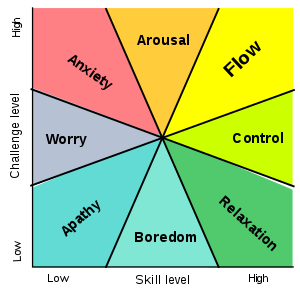

As yet another semester wraps up with finals, sleep deprivation, and a long-awaited summer break, another level of an aspiring programmer's journey is achieved. Although a few months is a very short amount of time, during these last few months I have built a strong foundation and understanding of several software engineering principles. I was able to learn concepts such as agile project management and ethics in software engineering, along with expanding on soft skills such as project planning, organizing team-oriented goals, and time management.

## Flow in Psychology

In psychology, there is a term for a "flow" state of being, which is also known informally as "being in the zone". In this state, a person is completely immersed in an activity with full focus, involvement, and enjoyment; it is when a person's challenge level and skill level meet at equal, high percentages. In contrast, when a person experiences low percentages in both their challenge level and skill level, they are in a mental state of "apathy". When starting with different classes in computer science, I would always be in a "control" mental state, but soon I fell towards more of the "anxiety" and "worry" mentality. When catching a glimpse of software engineering, I realized I was at a "flow" state of being. The topics were challenging, but I felt with every week, I was steadily becoming more and more skilled, and enjoying it more, too. (Image retrieved <a href="https://upload.wikimedia.org/wikipedia/commons/thumb/f/f6/Challenge_vs_skill.svg/300px-Challenge_vs_skill.svg.png">here</a>.)

### Agile Project Management

In a <a href="https://kirandatwani.github.io/essays/javascript.html">marathon</a>, there are different kinds of people, but for the sake of simplicity, two kinds of people are the sprinters and endurance runners. In the grand scheme of things, most people would be endurance runners with high stamina and mental strength not only in a marathon setting, but also in their personal and professional life. However, at least basing off most people I know (which would be my fellow college peers), most people are sprinters in their daily life. One project given a month in advance (so that the student can work on it for a month easily) becomes a rushed assignment in a matter of days with a few all-nighters. Most of this is based upon how difficult it is to divide a large task into smaller ones, and being able to estimate how long each task would take.

This is where Agile Project Management comes in, where a large task is divided up into smaller manageable tasks assigned to be completed in a given amount of time. This is extremely beneficial for large projects that seemingly appear impossible to start on or finish. A style of Agile Project Management is Issue Driven Project Management, or IDPM, for short. In IDPM, a project is divided up into manageable issues with tasks that can be divided into 72-hour increments, a few milestones so the application progresses, each member contributing to a couple of issues, and subsequent meeting times to keep everyone working on the project on the same page. (Image retrieved <a href="https://www.techrepublic.com/a/hub/i/r/2018/03/20/cad44d4d-6707-4703-9eeb-30d539d16a6e/resize/1200x/1be69d3ae9b7c4be604bd2d8058ed960/istock-844535646.jpg">here</a>.)

Agile Project Management has been invaluable in the sense that it has helped me manage my time better and break up daunting large projects into doable smaller ones. I was (and still am partially) a sprinter, and possibly perform better under pressure during a very short amount of time, but I learn time and time again how damaging that is to my mental health and overall motivation and confidence. Even now, I see the past projects that I could have easily managed if I had divided it up and took the time to complete each part piece by piece. I believe learning this project management style has been beneficial for my professional life, as I aspire to venture into project management or product management in the future, and the skills I learned will prove to be extremely helpful.

### Ethics in Software Engineering

Ethics appears to be a concept that solely belongs in topics such as law or philosophy, but ethics exist in software engineering, too. Ethics, in general, are moral principles that help people determine what's right and what's wrong. Ethics are not always black and white, and there are many underlying factors that may contribute to how ethical a person (and their actions) may be. With that being said, it is important for people to carry high moral standards, and be able to differentiate good and bad so the community they live in can be an ethical environment. (Image retrieved <a href="https://upload.wikimedia.org/wikipedia/commons/thumb/8/8e/Association_for_Computing_Machinery_%28ACM%29_logo.svg/1200px-Association_for_Computing_Machinery_%28ACM%29_logo.svg.png">here</a>.)

In the perspective of software engineering, ethics are moral principles that must be followed by software engineers in how they present themselves and how they create and implement their programming projects. It is important for software engineers, and any type of computer scientist to take ethics seriously, as it could cost them their career if a serious mistake is made. A useful way to determine if the programmer is being ethical with their program, and the program in itself is ethical, is to follow the rules and guidelines on the <a href="https://www.acm.org/code-of-ethics">ACM Code of Ethics and Professional Conduct</a> page. As web applications and mobile applications are used by nearly everyone in the world, it is necessary for software engineers to create and maintain ethical programs. Outside of software engineering, ethics can be applied to any realm or field. As long as the project is done honestly and with integrity, it is considered ethical.

## The End of the Beginning, the Beginning of the End

It might sound strange, but I am not too enthusiastic about beginnings and endings, be it in a movie, story, semester, or pretty much anything. For most people, beginnings are magical and exciting, and endings are wholesome and bittersweet. However for me, they just feel confusing and empty. As much as I love change, a part of me longs to stay in the calm middle of a story, or wishes it was still April, and not the end of another school year. It seems that time is traveling full-speed ahead, and I get closer and closer to the real world; and it's scary to think that in a little more than a year from now, I will be ending another chapter of my life, and starting a new one. That being said, it's not really another chapter, but more like a story in itself. So which part of my college career is the fundamentals of software engineering? Is it the end of the beginning because I am still very new in the field, and have just touched the tip of the iceberg? Or is it the beginning of the end, because I am getting closer to what I enjoy doing, and finding my path in computer science? I believe these are questions that I may find an answer to in a couple of years as I take more computer science classes and see where my passions truly lie.
