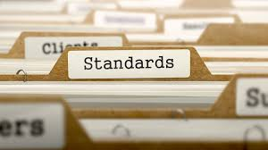

## Start of my Coding Journey

When I first started programming in college, my code was all over the place, and I didn't realize there was anything wrong until someone pointed it out, and helped me clean my code. I was surprised and intrigued because it was the first time someone had mentioned "coding standards", and before then, I was completely oblivious to it. If I were being honest, at that time, I didn't see the difference between my previous, messy code, and the new and improved, "cleaner" code. There were a few indents, and the close-curly-braces were adjusted to their proper lines, but to me, it looked pretty much the same. As someone who pays more attention to the small details rather than the big picture, I find it alarming how I wasn't able to nitpick on those tiny violations and errors when I first started. It is truly a skill to be able to write beautiful code, but sometimes without a proper background and understanding, that is much easier said than done. (Image retrieved <a href="https://businessanalystcoach.blog/2017/12/08/business-analysis-and-requirements-engineering-standards-for-information-technology-projects-an-overview/">here</a>.)

## Why is it so important?

In a way, coding standards can be trivial, and complex at the same time. I believe it depends highly on the experience of a programmer. For instance, a novice programmer might be focused on formatting, and aligning certain functions and braces, while a senior programmer might be more concerned about writing efficient, simple, easy-to-understand code in as few lines as possible. Regardless of the position of the programmer, I do think that coding standards improve the quality in writing code, but also being able to read and understand it. For new programmers, it is crucial to be able to read and understand code, especially one's own code. In this perspective, coding standards are very useful, because what the human eye misses, a tool, such as ESLint, would be able to quickly detect. In the short-term process, it might be irritable to constantly be given error warnings, but in a way, it helps to understand the problem for the error more efficiently, and in the long-term, assists the programmer in writing cleaner code.

## New Language, New Standards

I remember there being coding standards given by my professors in previous ICS classes, but the IDEs that were being used, such as Eclipse and the terminal, didn't consist of tools that would assist in telling me that I am heading in the wrong direction or if my code was messy. It was something I had to check and confirm myself. Having ESLint with IntelliJ checking and picking on each error is sometimes frustrating, but more than that, it is useful and much needed. I feel the same satisfaction seeing the green checkmark as I do when I complete a task or assignment for the day.

I would express that it is a new experience and uncomfortable at times continuously seeing the yellow warning triangle, or the bright red error sign. I believe that is with anything new, change starts off as undesirable, and potentially this could be a new system I grow fond of. After being acquainted with JSFiddle for a few weeks, it was difficult to start on something new again, but I think this is part of the learning process. It would have been tiresome to proceed with JSFiddle because sometimes it's hard to tell where the error or code went wrong, and by the time the mistake is found, several lines have been written and run. In this perspective, I think it might be useful to have a tool that automatically picks up issues and gives warnings.
