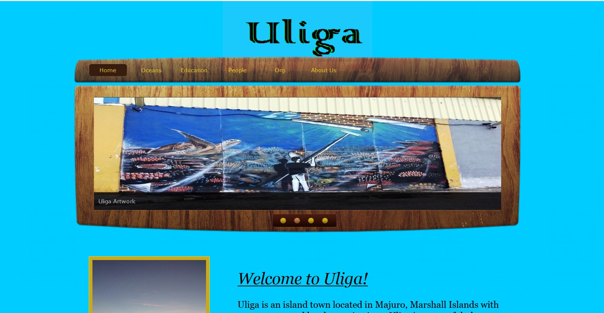

One of the first hands-on project I coded in was a simple "blogsite" style website using HTML and CSS. I received inspiration from a variety of fields, and created a simple project I was proud of. This was also the first time that I can remember that I started seeing code, and becoming impatient with constant errors because I missed a semicolon or a comma, or misspelled a word. I enjoyed writing, and for me, this was a completely different realm unlike no other field. With minimal mistakes, and possible grammatical errors, a paper can be passed as adequate, but when it comes to coding or programming, even simple things, everything must be in the right place, or the entire program will fail. I learned this the hard way when I was working on the early projects in the class.

I learned plentiful from working with team members on a combined project. We were all assigned our individual tasks.

 
<a href="https://github.com/theVacay/vacay"><i class="large github icon"></i>theVacay/vacay</a>
