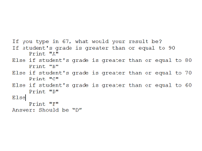
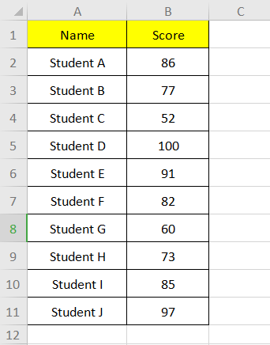

As a Honors student at the University of Hawaii at Manoa, a part of my degree requirement is completing research in my field, and writing a thesis. I am currently developing my research on human-computer interaction while focusing on computational thinking. The title of my project is "Understanding Humans’ Cognitive Processes During Computational Thinking Through Cognitive Science".

"My specific aims in this project include: to understand different peoples’ computational thinking, and the amount of time it takes for a person depending on the level of their computer literacy (e.g., programming novices, computer science majors, general public) to identify, understand, and solve a problem. Secondly, to identify the level of expertise of participants, and determining different approaches to be taken in order for participants to understand the bigger picture of a program. Alongside my aims, I have made probable research questions as well: what facets/aspects of cognitive science help researchers in human-computer interaction (HCI) understand how people interact with computers? Are there existing relationships between cognitive science at an individual level in problem-solving and HCI at a group or community level?"

## Abstract

The following consists of my abstract for my honors thesis proposal:

<blockquote> Human-computer interaction is a diverse field covering disciplines such as computer technology, human factors, and cognitive science to name a few. Over the past several years, the information age has developed to incorporate a society that intentionally and unintentionally interacts with computing technology everyday. The field of computational thinking in human-computer interaction is expanding and incorporating multidisciplinary fields such as psychology and software principles. Research has been conducted in the past regarding the background, social impact and innovation, and a new direction in social computing/ issues in HCI. HCI is a diverse, expansive field covering many aspects and disciplines in computer science, the humanities, and others. Computational thinking, a subfield of HCI, explores the way humans process problems, and use problem-solving skills and analogies to solve complex, or seemingly difficult problems (Wing, 2006). This research project will be conducted in order to understand computational thinking in people, along with determining the existing relationship between cognitive science and HCI. </blockquote>

## Pseudocode & Excel

My role as a researcher in this project will consist of three steps. During the first step, I will develop the proposal and an execution plan and/or design. The second step will be collecting written work in computational thinking, along with developing a group of problems in the program, Microsoft Excel, and pseudocode, that will allow me to be able to observe HCI and human usability in computing technology. The spreadsheet problems and the pseudocode problems will be the same 12 problems, but I will be dividing the group of participants in two test groups where they will have alternating problems. In other words, one test group would have 6 spreadsheet problems and 6 pseudocode problems, and the other group would have the other 6 spreadsheet problems and the other 6 pseudocode problems. The goal of the participants would be to analyze and comprehend the problem, and explain what the problem is doing. Tentatively, during the summer of 2021, a pilot program will be conducted for a ICS 101 class. Finally, the last step will be collecting the data, analyzing the results, and forming the conclusion. A possible example of a pseudocode problem is located above the abstract, and an example of a Spreadsheet problem is located on the right side.

You can learn more about my honors project and see the current draft of my thesis proposal <a href="https://drive.google.com/file/d/1Dx1xL06i7YLeaqLTLAmJ5f5Iz6gUJx56/view?usp=sharing">here</a>.
