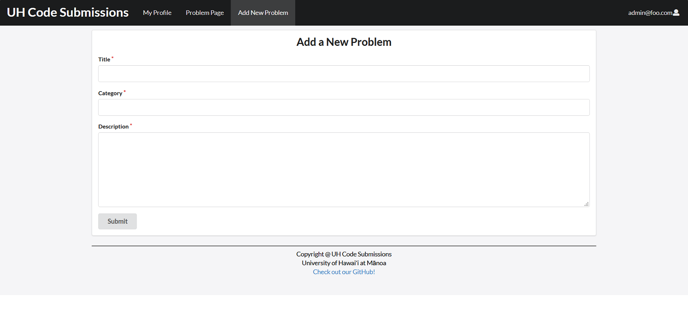
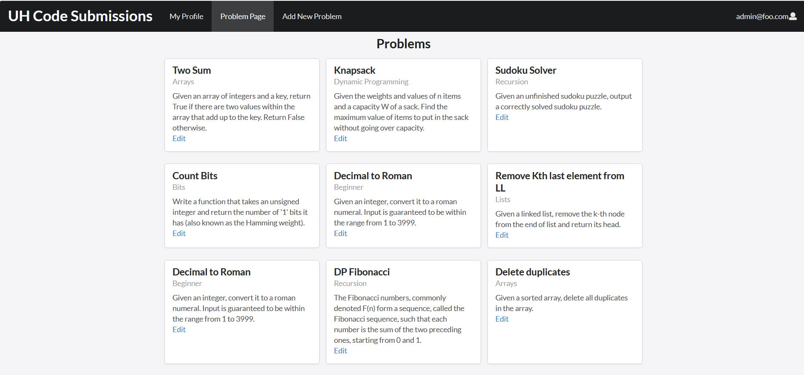

## Overview

I learned several concepts and aspects of software engineering in my ICS 314: Software Engineering I class. A month before the end of the semester, students were assigned to complete a working web application in groups of 3-5 people that will serve the UH community in some way. My group was selected to create a web application that will allow UHM students, specifically the ones in computer science, who either want to improve their skills in algorithms or are preparing for technical interviews. An alternate to websites such as LeetCode, UH Code Submissions serves mainly for members of PANDA (Programming and Algorithms) SIG of ACM Manoa as an efficient, comprehensive location to submit and store problems and solutions.

#### This application includes:
- New Problem Page (admin): a page where only admins can add new problems.
- Problems Page (admin): a page with published problems by the admin. The admin is able to edit problems on the problems page. Each problem includes a brief overview of the problem and a tag for its category.
- Problems Page (user): a page with published problems by the admin. A user is able to submit a solution to a selected problem. Similar to the admin's side, each problem includes a brief overview of the problem and a tag for its category.
- Solutions Page (user): the user is directed here after selecting to submit a solution to a problem.
- Profile Page (admin and user): admins and users have their own profile page where they are able to write (and edit) a short bio about themselves.

## Development Process

A little more than a year ago, I was conflicted in majoring in computer science. It seemed like all the wishes and dreams I had had for the last three to four years were impossible to accomplish, and the experience of programming and problem-solving that once brought me a sense of comfort and satisfaction were slowly losing their magic touch. What I would spend hours on in the past trying to understand suddenly became too painful and frustrating. What once brought me joy seemed too difficult to continue. I was trying to remember what made me fall in love with technology and programming in the first place.

 

I embarked on a new journey, but it wasn't easy. I didn't realize what exactly "ikigai" meant to people, much less myself; most of the information was in journals dating several years ago, but for the most part, I hadn't realized how many people in Japan were in the same situation as me. People in schools, colleges, and workplaces all felt that they had to contribute a part of themselves for the betterment for the whole of the community, whether that be in their family or workplace. Better late than never, I realized that the people who were living with "ikigai" weren't trying to, but they would accept their situation and find peace knowing that what is meant to happen will happen.

## Accomplishments

While this paper reflected less on my personal thoughts, I was able to convey the message I had learned and observed while studying abroad. Alongside this paper, because I was studying abroad precisely at the time the pandemic began to grow, I worked on a more reflective piece about my experiences studying abroad during a pandemic as an international student.

This was a group project completed by the following members: Chad Oshiro, Kanai Gooding, Tristan DeAguiar, and Kiran Datwani (myself). To learn more about this project, please visit our project page or our github repository:

<a href="https://uh-code-submissions.github.io/"><i class="large github icon"></i>UH Code Submissions Project Page</a> - <a href="https://github.com/uh-code-submissions"><i class="large github icon"></i>UH Code Submissions GitHub Repository</a>
